# 0x01 一个简单的例子

先找一台开了com远程访问的机器直接进行访问，然后直接执行命令，发现可以建立连接

然后关闭com的远程访问功能，发现失去了该功能

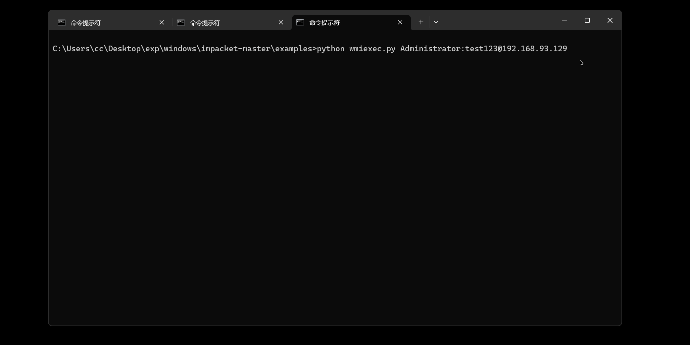

然后我们看一下这条提示

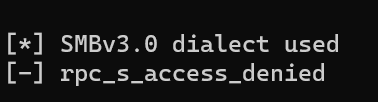

回显是

rpc_s_access_denied

那么这里会引申出一个问题，我用445在这里做wmiexec关dcom组件什么事情？

# 0x02 wmiexec的本质

要看wmiexec到底做了什么，还是需要了解wmi本身的工作机理。

wmi本质上还是调用com组件来进行操作，因此我在组件服务这块改com组件的配置会影响到wmi的使用。

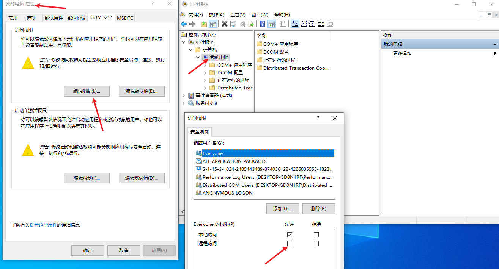

然后就是wmi通信和回显的方式

这里首先明确一点，wmi本身并不支持回显，他就是执行命令而已，回显的东西都是广大网友魔改的。

诸如我用的wmiexec.py，这里执行完命令，然后把命令的结果写入文件，然后再调用smb把回显读取出来，然后再传送回来。

wmi本身只支持两种协议，一种dcom一种winr，分别对应的端口是135和5985，本文主要关注到135端口的dcom通信。

在wmi使用dcom的过程中，会用到两个端口。

一个是本身我们熟悉的135端口，另一个端口是一个任意的高位端口（通常在49152到65535之间）

那么为什么会使用到两个端口呢？

其实这里是为了安全，把认证的过程和后续数据传输的过程分开了。

wmi首先通过135进行TCP连接，在这个过程中wmi的client和server端进行身份认证校验，主要是一个建立session的过程。

那么另一个高位端口，是负责实际传输数据用的。

传输什么数据呢？例如我现在通过wmi，在我的攻击机上执行一个whoami命令，然后这条命令的流量就通过这个高位端口进行传输，并不走135端口。

同时使用wmi需要具备一定的权限，需要本地管理员或域管理员才可以进行正常使用。

那么这里回过头来看大家经常使用的wmiexec.py脚本

为了方便理解，我直接从最后的执行脚本来看

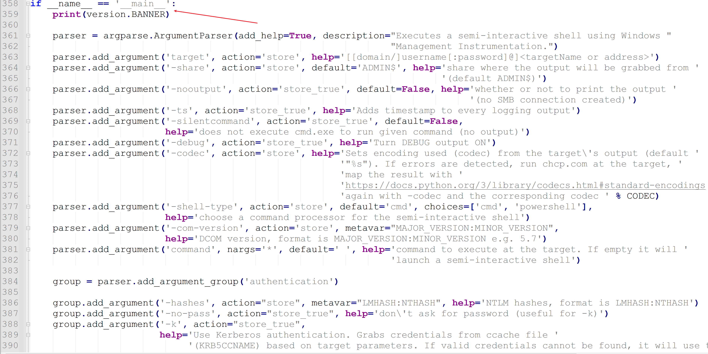

最后这里开始主逻辑之后，先是获取传入的参数。

和我们主题不相干的我们都不看，直接看到最后的执行逻辑。

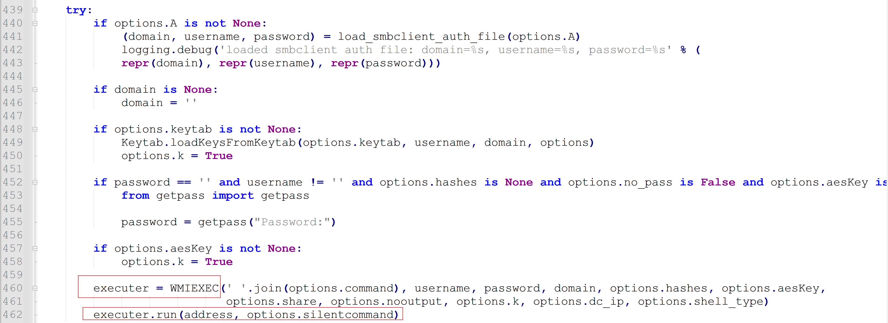

这里是先实例化WMIEXEC这个class，然后再调用类中已经实例化后的run方法进行执行。

那么回溯到run方法

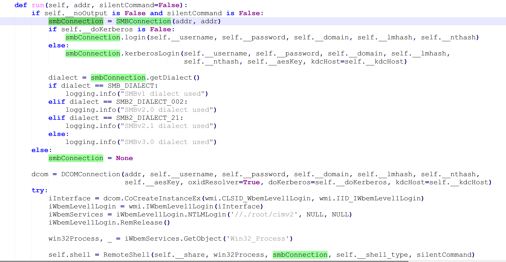

这里需要着重关注到前面的判断逻辑

打开-h看一看wmiexec.py的解释

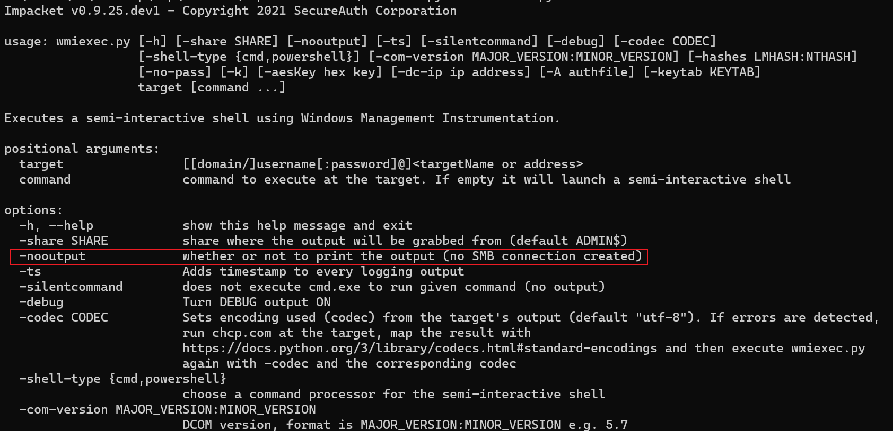

当中注意到有一个-nooutput的选项，这个选项代表不做回显。

那么默认wmiexec.py的逻辑是什么呢？

回归到代码中查看

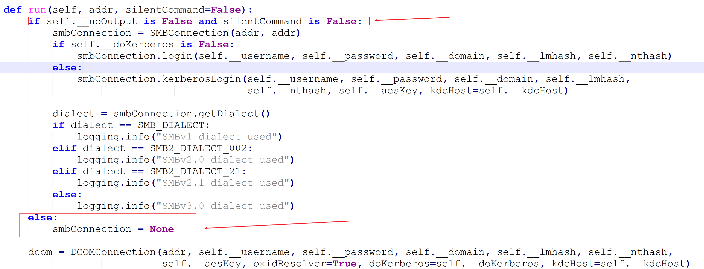

这里明明白白的写了，如果noputput选项为false并且slientcommand为flase，就走下面的smbconnection，否则跳到else语句，不走smb连接，仅仅只走dcomconnection连接。

什么意思呢，就是说，如果在参数选择上选择使用无回显，仅仅执行命令的操作，其实就只走dcom的连接方式，即走135端口。

如果不加上这个无回显操作，那么不但需要135端口的DCOM支持，还需要走445端口的smb连接，从而实现执行完命令之后回显的功能。

ok，那么这里一旦梳理清楚之后，后续利用的时候就可以根据我们自己的需要选择对应的利用方法。

# 0x03 wmiexec的实战利用

**情况1：COM直接被干了**

在最上面的举例中，我们看到了，如果关闭了远程的COM组件调用，就无法进行远程wmi连接。

针对这一点上，可以尝试利用winrm进行利用，毕竟wmi还有一种调用方法。

**情况2：445端口被干了，但是135还在**

根据上面的解释，我们可以了解到，445主要是wmiexec用来回显的一个玩意，不用445其实也可以执行命令。

下面准备一个实验环境

刚刚是有445的

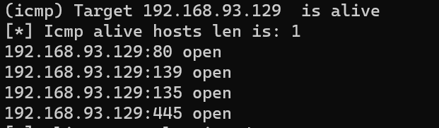

这里我在windows的防火墙上加一条规则，直接把445给干了

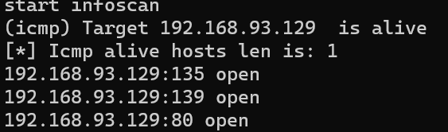

ok，那在这个场景下，我再尝试进行wmiexec默认配置测试，看看是什么情况。

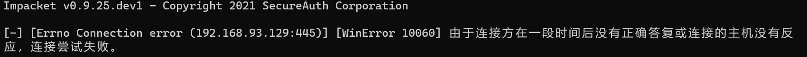

这里就直接跳失败了，原因是因为445被我干了。

那么这里尝试用上面我们分析过代码的-nooutput参数来尝试一下。

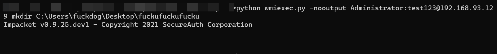

这里没有回显输出

查看受害者机器

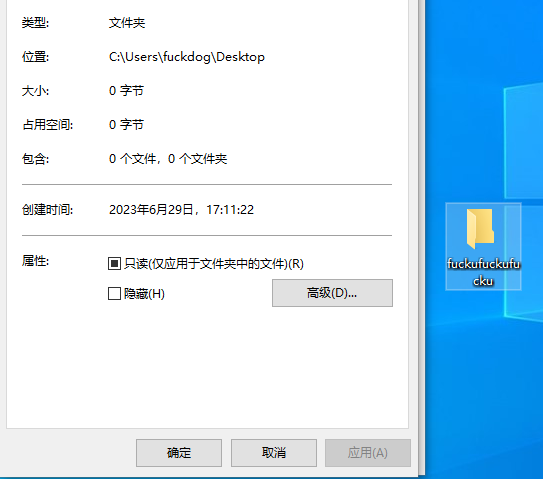

文件已经被创建完成

那么实战环境中，一旦出现445端口被ban的情况，就可以用这个参数来进行绕过。

**情况3：135，445都打开了，但是桌面端装了著名杀软天擎或者其他著名杀软**

如下

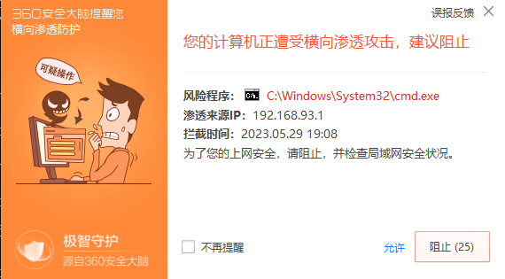

这里其实属于另外一个大专题了，后续再进行专题更新。

